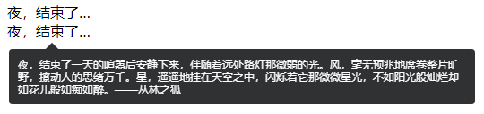
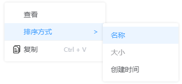

# vue-extend-directives

适用于 vue3 的扩展指令

## 安装
 
```
npm install vue-extend-directives
```

```js
import vueExtendDirects from "vue-extend-directives";

// 默认样式
import 'vue-extend-directives/dist/style.css';  

app.use(vueExtendDirectives);
```
## 指令：v-hide

- 用处：文本内容超出隐藏（文本容器必须给定宽度），并通过提示框框展示全部。

- 参数：提示框内容是否可以复制，`boolean`类型，非必填，默认可复制。

    

## 指令：v-contextmenu

- 用处：右键菜单

- 参数：非必填，展示默认样式，无实际作用

    - [单文件组件](./test/contextmenu/sfc-menu.vue)
        
        ```js
        import sfcMenu from './sfc-menu.vue';
        // 无参数：
        <div v-contextmenu="sfcMenu"></div>

        /**
         * 有参数：
         * sfc：必传，引入的单文件组件实例
         * props：非必传，对象，需要传递的属性、方法
         */
        <div v-contextmenu="{sfc:sfcMenu,props:{list,clickFun}}"></div>

        ```

    - [对象数组：](./test/contextmenu/array-menu.vue)

        

        ```js
        [{
            label: string;      // 标题
            click?: object;     // 点击事件名，存在子菜单时自动忽略
            divid?: true;       // 分割线
            disable?: boolean;  // 是否禁用
            ico?: string;       // 图标：图片地址
            sub?: string;       // 副标题
            children?: [{       // 子菜单
                label: string;
                click?: object; // 点击事件名
                disable?: boolean;
            }]
        }]
        ```
        PS：`click`（回调函数）自动接收同级`label`作为参数

